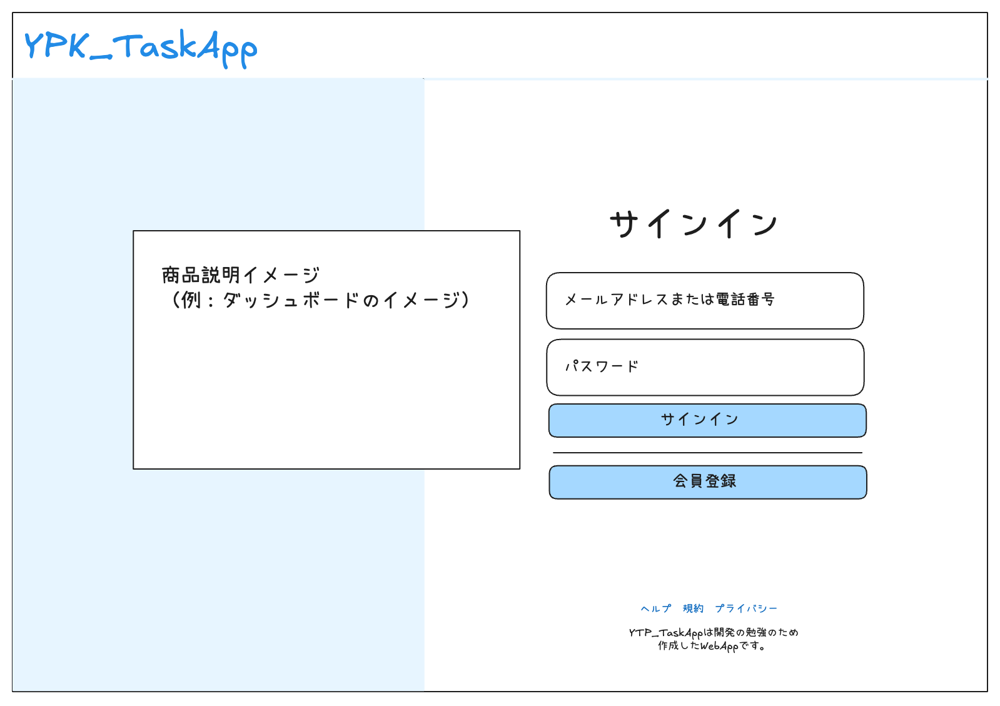
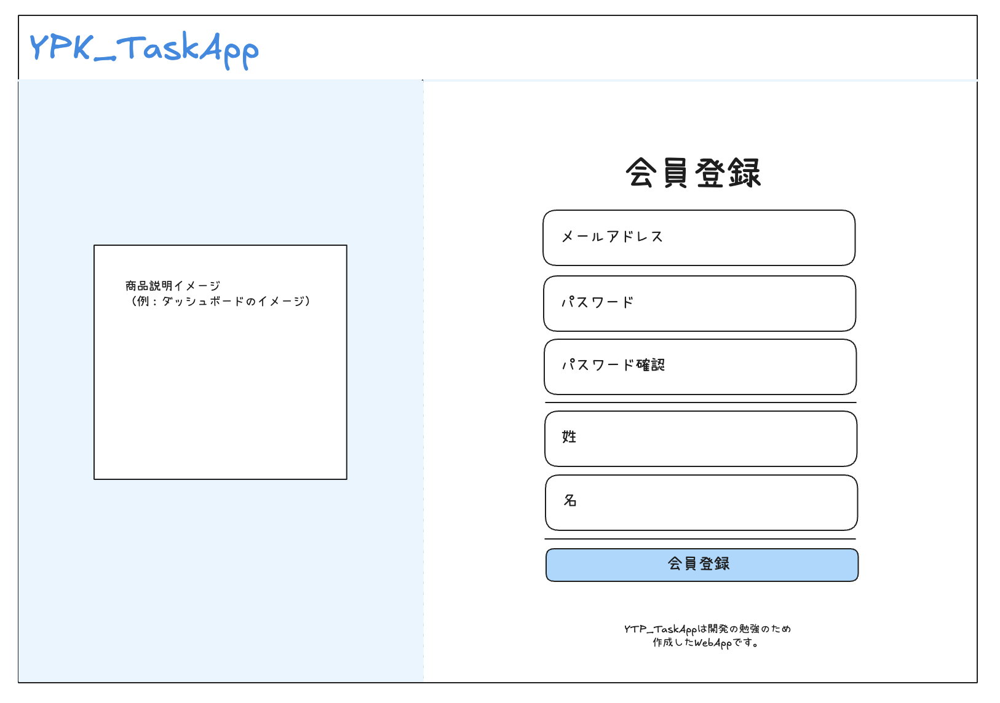
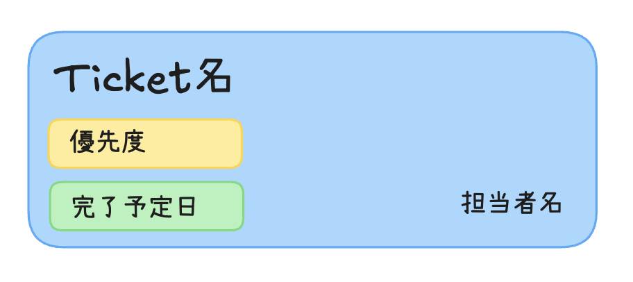

### [画面設計書]

## 1. ログイン画面

| No | 項目 |　詳細 |
| :-- | :-- | :-- |
| 1 | ヘルプ,規約などの<a>Tag | 転移先をまず空白にする |
| 2 | ID入力欄 | メールアドレス入力　（電話番号と書いてるが電話番号は無しで）|
| 3 |サインインButton | クリックすると成功の場合`ダッシュボード画面`に、失敗の場合再認証要請のメッセージを`サインイButton`のしたに出力 |
| 4 |会員登録Button | クリックすると`会員登録画面`に遷移 |
| 5 | 商品説明イメージ | TaskAppのダッシュボードのイメージを入れてAppのイメージを分かるようにする |

---

## 2. 会員登録画面

| No | 項目 |　詳細 |
| :-- | :-- | :-- |
| 1 | メールアドレス | メールアドレス形式確認 |
| 2 | password | password形式確認 (8文字以上、英数字、特殊記号)|
| 3 |　password確認 | passwordと一致有無確認 |
| 4 |　姓 | 空白OK |
| 5 | 名 | 空白OK |
| 6 | 会員登録Button | クリックすると`会員登録完了画面`に遷移 |
| 7 | 商品説明イメージ | TaskAppのダッシュボードのイメージを入れてAppのイメージを分かるようにする |

---

## 3. 会員登録完了画面

<設計無し>

| No | 項目 |　詳細 |
| :-- | :-- | :-- |
| - | - | - |

---

## 4. ダッシュボード画面

 を表示|
| 5 | Board | クリックすると`ダッシュボード画面`を表示 |
---

## 5. TicketCard

| No | 項目 |　詳細 |
| :-- | :-- | :-- |
| 1 | Ticket名 | Ticketの名前を表示 |
| 2 | 優先度 | チケットの優先度を表示、なければ非表示　|
| 3 |　完了予定日 | Ticketの完了予定日を表示、、なければ非表示 |
| 4 | 担当者名 | 担当者名を表示、なければ’担当無し’を表示 |

